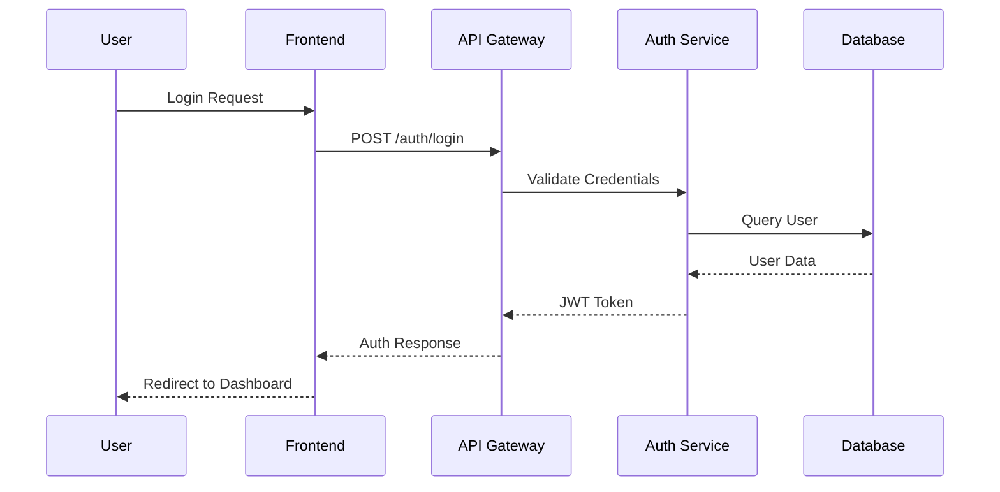

# Arquitetura do ScanIA

## 🏗️ Visão Geral da Arquitetura

O ScanIA foi projetado seguindo uma arquitetura de **microservices moderna** com princípios de **clean architecture** e **domain-driven design**.

```
┌─────────────────────────────────────────────────────────────┐
│                    CAMADA DE APRESENTAÇÃO                   │
├─────────────────────────────────────────────────────────────┤
│  Web App (React/Next.js)  │  Mobile App   │  CLI Tool      │
│  - Interface de Chat       │  - Notificações│  - Automação   │
│  - Dashboards             │  - Relatórios  │  - Scripts     │
│  - Relatórios             │  - Consultas   │  - CI/CD       │
└─────────────────────────────────────────────────────────────┘
                              │
                              │ HTTPS/WSS
                              ▼
┌─────────────────────────────────────────────────────────────┐
│                     API GATEWAY (NGINX)                     │
├─────────────────────────────────────────────────────────────┤
│  - Rate Limiting          │  - Load Balancing              │
│  - Authentication         │  - SSL Termination             │
│  - Request Routing        │  - Caching                     │
└─────────────────────────────────────────────────────────────┘
                              │
                              ▼
┌─────────────────────────────────────────────────────────────┐
│                   CAMADA DE APLICAÇÃO                       │
├─────────────────────────────────────────────────────────────┤
│                                                             │
│  ┌─────────────────────────────────────────────────────┐   │
│  │              CORE API (FastAPI)                     │   │
│  ├─────────────────────────────────────────────────────┤   │
│  │  • Auth Service      • Chat Service                 │   │
│  │  • User Management   • Report Generator             │   │
│  │  • Project Manager   • Dashboard API                │   │
│  │  • Notification Hub  • WebSocket Manager            │   │
│  └─────────────────────────────────────────────────────┘   │
│                                                             │
│  ┌─────────────────────────────────────────────────────┐   │
│  │            SCANNER ENGINE (Python)                  │   │
│  ├─────────────────────────────────────────────────────┤   │
│  │  • Vulnerability Scanner  • OWASP ZAP Integration   │   │
│  │  • Port Scanner (Nmap)    • Nuclei Engine           │   │
│  │  • SSL/TLS Analyzer       • Custom Modules          │   │
│  │  • Web Crawler           • CVE Database             │   │
│  └─────────────────────────────────────────────────────┘   │
│                                                             │
│  ┌─────────────────────────────────────────────────────┐   │
│  │               AI ENGINE (Python)                    │   │
│  ├─────────────────────────────────────────────────────┤   │
│  │  • NLP Processor         • Threat Intelligence      │   │
│  │  • Risk Assessment       • Automated Remediation    │   │
│  │  • Pattern Recognition   • Predictive Analysis      │   │
│  │  • Chat Bot Engine       • ML Models                │   │
│  └─────────────────────────────────────────────────────┘   │
│                                                             │
└─────────────────────────────────────────────────────────────┘
                              │
                              ▼
┌─────────────────────────────────────────────────────────────┐
│                   CAMADA DE DOMÍNIO                         │
├─────────────────────────────────────────────────────────────┤
│                                                             │
│  ┌─────────────────┐  ┌─────────────────┐  ┌─────────────┐ │
│  │   USER DOMAIN   │  │  SECURITY DOMAIN │  │ REPORT DOMAIN│ │
│  ├─────────────────┤  ├─────────────────┤  ├─────────────┤ │
│  │ • User Entity   │  │ • Vulnerability │  │ • Report     │ │
│  │ • Profile       │  │ • Scan Result   │  │ • Template   │ │
│  │ • Permissions   │  │ • Threat        │  │ • Export     │ │
│  │ • Subscription  │  │ • Risk Score    │  │ • Dashboard  │ │
│  └─────────────────┘  └─────────────────┘  └─────────────┘ │
│                                                             │
└─────────────────────────────────────────────────────────────┘
                              │
                              ▼
┌─────────────────────────────────────────────────────────────┐
│                 CAMADA DE INFRAESTRUTURA                    │
├─────────────────────────────────────────────────────────────┤
│                                                             │
│  ┌─────────────────┐  ┌─────────────────┐  ┌─────────────┐ │
│  │   DATABASES     │  │     CACHE       │  │   STORAGE   │ │
│  ├─────────────────┤  ├─────────────────┤  ├─────────────┤ │
│  │ • PostgreSQL    │  │ • Redis         │  │ • MinIO     │ │
│  │   - Users       │  │   - Sessions    │  │   - Reports │ │
│  │   - Scans       │  │   - Cache       │  │   - Files   │ │
│  │   - Reports     │  │   - Pub/Sub     │  │   - Backups │ │
│  │   - Logs        │  │   - Queue       │  │   - Assets  │ │
│  └─────────────────┘  └─────────────────┘  └─────────────┘ │
│                                                             │
│  ┌─────────────────┐  ┌─────────────────┐  ┌─────────────┐ │
│  │  MONITORING     │  │   MESSAGING     │  │  EXTERNAL   │ │
│  ├─────────────────┤  ├─────────────────┤  ├─────────────┤ │
│  │ • Prometheus    │  │ • RabbitMQ      │  │ • CVE APIs  │ │
│  │ • Grafana       │  │ • Celery        │  │ • OSINT     │ │
│  │ • ELK Stack     │  │ • WebSockets    │  │ • Threat    │ │
│  │ • Alertmanager  │  │ • Event Bus     │  │   Intel     │ │
│  └─────────────────┘  └─────────────────┘  └─────────────┘ │
│                                                             │
└─────────────────────────────────────────────────────────────┘
```

## 🏢 Componentes Principais

### 1. Frontend (React/Next.js)

```typescript
src/
├── components/
│   ├── chat/
│   │   ├── ChatInterface.tsx
│   │   ├── MessageBubble.tsx
│   │   └── ChatInput.tsx
│   ├── dashboard/
│   │   ├── SecurityDashboard.tsx
│   │   ├── VulnerabilityChart.tsx
│   │   └── ThreatMap.tsx
│   ├── scanner/
│   │   ├── ScannerForm.tsx
│   │   ├── ScanProgress.tsx
│   │   └── ScanResults.tsx
│   └── reports/
│     ├── ReportViewer.tsx
│     ├── ReportGenerator.tsx
│     └── PDFExporter.tsx
├── pages/
│   ├── dashboard/
│   ├── scanner/
│   ├── reports/
│   └── chat/
├── hooks/
│   ├── useWebSocket.ts
│   ├── useScanner.ts
│   └── useAuth.ts
├── services/
│   ├── api.ts
│   ├── websocket.ts
│   └── scanner.ts
└── types/
    ├── api.ts
    ├── scanner.ts
    └── user.ts
```

### 2. Backend Core (FastAPI)

```python
app/
├── api/
│   ├── v1/
│   │   ├── auth.py
│   │   ├── scanner.py
│   │   ├── reports.py
│   │   ├── chat.py
│   │   └── dashboard.py
│   └── dependencies.py
├── core/
│   ├── config.py
│   ├── security.py
│   ├── database.py
│   └── websocket.py
├── models/
│   ├── user.py
│   ├── scan.py
│   ├── vulnerability.py
│   └── report.py
├── services/
│   ├── auth_service.py
│   ├── scanner_service.py
│   ├── report_service.py
│   ├── chat_service.py
│   └── ai_service.py
├── schemas/
│   ├── user.py
│   ├── scan.py
│   └── report.py
└── utils/
    ├── security.py
    ├── validators.py
    └── helpers.py
```

### 3. Scanner Engine

```python
scanner/
├── engines/
│   ├── owasp_zap.py
│   ├── nuclei.py
│   ├── nmap.py
│   ├── ssl_analyzer.py
│   └── web_crawler.py
├── analyzers/
│   ├── vulnerability_analyzer.py
│   ├── risk_assessor.py
│   ├── compliance_checker.py
│   └── threat_correlator.py
├── databases/
│   ├── cve_db.py
│   ├── threat_intel.py
│   └── signatures.py
└── reporting/
    ├── pdf_generator.py
    ├── html_generator.py
    └── json_exporter.py
```

## 🔐 Segurança da Arquitetura

### Camadas de Segurança

1. **Rede**
   - WAF (Web Application Firewall)
   - DDoS Protection
   - SSL/TLS Encryption
   - VPN para acesso interno

2. **Aplicação**
   - JWT Authentication
   - OAuth2/OIDC Integration
   - RBAC (Role-Based Access Control)
   - Input Validation & Sanitization

3. **Dados**
   - Encryption at Rest
   - Encryption in Transit
   - Database Access Controls
   - Audit Logging

4. **Infraestrutura**
   - Container Security
   - Secrets Management
   - Network Segmentation
   - Monitoring & Alerting

### Fluxo de Autenticação



## 📊 Banco de Dados

### Modelo de Dados Principal

```sql
-- Usuários e Autenticação
CREATE TABLE users (
    id UUID PRIMARY KEY DEFAULT gen_random_uuid(),
    email VARCHAR(255) UNIQUE NOT NULL,
    password_hash VARCHAR(255) NOT NULL,
    full_name VARCHAR(255) NOT NULL,
    role VARCHAR(50) DEFAULT 'user',
    is_active BOOLEAN DEFAULT true,
    created_at TIMESTAMP DEFAULT NOW(),
    updated_at TIMESTAMP DEFAULT NOW()
);

-- Projetos de Segurança
CREATE TABLE projects (
    id UUID PRIMARY KEY DEFAULT gen_random_uuid(),
    user_id UUID REFERENCES users(id),
    name VARCHAR(255) NOT NULL,
    description TEXT,
    targets JSONB NOT NULL,
    status VARCHAR(50) DEFAULT 'active',
    created_at TIMESTAMP DEFAULT NOW()
);

-- Scans de Vulnerabilidade
CREATE TABLE scans (
    id UUID PRIMARY KEY DEFAULT gen_random_uuid(),
    project_id UUID REFERENCES projects(id),
    target_url VARCHAR(500) NOT NULL,
    scan_type VARCHAR(100) NOT NULL,
    status VARCHAR(50) DEFAULT 'pending',
    started_at TIMESTAMP,
    completed_at TIMESTAMP,
    results JSONB,
    metadata JSONB
);

-- Vulnerabilidades Encontradas
CREATE TABLE vulnerabilities (
    id UUID PRIMARY KEY DEFAULT gen_random_uuid(),
    scan_id UUID REFERENCES scans(id),
    cve_id VARCHAR(50),
    severity VARCHAR(20) NOT NULL,
    title VARCHAR(500) NOT NULL,
    description TEXT,
    solution TEXT,
    cvss_score DECIMAL(3,1),
    affected_url VARCHAR(500),
    evidence JSONB,
    created_at TIMESTAMP DEFAULT NOW()
);

-- Relatórios Gerados
CREATE TABLE reports (
    id UUID PRIMARY KEY DEFAULT gen_random_uuid(),
    scan_id UUID REFERENCES scans(id),
    type VARCHAR(50) NOT NULL,
    format VARCHAR(20) NOT NULL,
    file_path VARCHAR(500),
    status VARCHAR(50) DEFAULT 'generating',
    generated_at TIMESTAMP,
    expires_at TIMESTAMP
);

-- Chat e Conversas
CREATE TABLE conversations (
    id UUID PRIMARY KEY DEFAULT gen_random_uuid(),
    user_id UUID REFERENCES users(id),
    title VARCHAR(255),
    context JSONB,
    created_at TIMESTAMP DEFAULT NOW()
);

CREATE TABLE messages (
    id UUID PRIMARY KEY DEFAULT gen_random_uuid(),
    conversation_id UUID REFERENCES conversations(id),
    role VARCHAR(20) NOT NULL, -- 'user' or 'assistant'
    content TEXT NOT NULL,
    metadata JSONB,
    created_at TIMESTAMP DEFAULT NOW()
);
```

### Cache Strategy (Redis)

```python
# Estrutura de Cache
{
    "user_sessions:{user_id}": {
        "session_data": "...",
        "expiry": 3600
    },
    "scan_results:{scan_id}": {
        "vulnerabilities": [...],
        "metadata": {...},
        "expiry": 7200
    },
    "dashboard_data:{user_id}": {
        "recent_scans": [...],
        "stats": {...},
        "expiry": 300
    }
}
```

## 🚀 Deploy e Escalabilidade

### Container Architecture

```yaml
version: '3.8'
services:
  nginx:
    image: nginx:alpine
    ports:      ["80:80", "443:443"]
    depends_on: [frontend, api]
    
  frontend:
    build: ./frontend
    ports: ["3000:3000"]
    
  api:
    build: ./backend
    ports: ["8000:8000"]
    depends_on: [postgres, redis]
    
  scanner:
    build: ./scanner
    depends_on: [api, postgres]
    
  postgres:
    image: postgres:15
    volumes: ["postgres_data:/var/lib/postgresql/data"]
    
  redis:
    image: redis:alpine
    volumes: ["redis_data:/data"]
    
  monitoring:
    image: prom/prometheus
    ports: ["9090:9090"]
```

### Horizontally Scalable Components

1. **API Servers**: Load balanced com NGINX
2. **Scanner Workers**: Queue-based com Celery
3. **AI Processing**: GPU workers separados
4. **Static Assets**: CDN (CloudFlare/AWS)

## 📈 Performance e Monitoramento

### Métricas Chave
- **Response Time**: < 200ms para API calls
- **Scan Duration**: < 5min para scans básicos
- **Throughput**: 100+ concurrent scans
- **Availability**: 99.9% uptime

### Observabilidade
- **Logs**: ELK Stack (Elasticsearch, Logstash, Kibana)
- **Métricas**: Prometheus + Grafana
- **Traces**: Jaeger para distributed tracing
- **Alertas**: AlertManager + PagerDuty

---

Esta arquitetura permite escalabilidade horizontal, alta disponibilidade e extensibilidade para futuras funcionalidades de cybersegurança.