# Diagramas de Arquitetura - ScanIA

## 🏗️ Visão Geral da Arquitetura

### Diagrama de Alto Nível


## 🔄 Fluxos de Processo

### 1. Fluxo de Autenticação


### 2. Fluxo de Scanner de Vulnerabilidades


### 3. Fluxo de Geração de Relatórios

```mermaid
sequenceDiagram
    participant User as Usuário
    participant Frontend as Web App
    participant API as Core API
    participant ReportGen as Report Generator
    participant DB as PostgreSQL
    participant Storage as MinIO
    participant Email as Email Service
    
    User->>Frontend: Request report
    Frontend->>API: POST /reports/generate
    API->>DB: Create report record
    API->>ReportGen: Generate report (async)
    API-->>Frontend: Report ID + status
    
    ReportGen->>DB: Query scan data
    DB-->>ReportGen: Vulnerabilities + metadata
    ReportGen->>ReportGen: Generate PDF
    ReportGen->>Storage: Store PDF file
    ReportGen->>DB: Update report status
    
    opt Email notification
        ReportGen->>Email: Send notification
        Email-->>User: Report ready email
    end
    
    ReportGen-->>API: Report completed
    API-->>Frontend: Status update
    Frontend-->>User: Download available
    
    User->>Frontend: Download report
    Frontend->>API: GET /reports/{id}/download
    API->>Storage: Retrieve file
    Storage-->>API: PDF file
    API-->>Frontend: File stream
    Frontend-->>User: Download starts
```



## 🗃️ Modelo de Dados

### Diagrama Entidade-Relacionamento


### Modelo Lógico Detalhado

```mermaid
classDiagram
    class User {
        +UUID id
        +String email
        +String passwordHash
        +String fullName
        +UserRole role
        +Boolean isActive
        +JSON preferences
        +DateTime createdAt
        +DateTime updatedAt
        +List~Scan~ scans
        +List~Conversation~ conversations
        +authenticate(password: String): Boolean
        +generateJWT(): String
        +hasPermission(action: String): Boolean
    }
    
    class Scan {
        +UUID id
        +UUID userId
        +String targetUrl
        +List~String~ scanTypes
        +ScanStatus status
        +JSON options
        +DateTime startedAt
        +DateTime completedAt
        +Integer durationSeconds
        +String celeryJobId
        +String errorMessage
        +List~Vulnerability~ vulnerabilities
        +List~Report~ reports
        +calculateRiskScore(): Float
        +getVulnerabilitySummary(): JSON
        +canUserAccess(userId: UUID): Boolean
    }
    
    class Vulnerability {
        +UUID id
        +UUID scanId
        +String vulnerabilityId
        +String cveId
        +Severity severity
        +Float cvssScore
        +String title
        +String description
        +String solution
        +String affectedUrl
        +JSON evidence
        +VulnStatus status
        +String remediationNotes
        +getSeverityWeight(): Float
        +isCritical(): Boolean
        +markAsFixed(): Void
    }
    
    class Report {
        +UUID id
        +UUID scanId
        +ReportType reportType
        +String format
        +String title
        +String description
        +String filePath
        +Integer fileSize
        +ReportStatus status
        +DateTime generatedAt
        +DateTime expiresAt
        +JSON metadata
        +generatePDF(): String
        +isExpired(): Boolean
        +getDownloadUrl(): String
    }
    
    class Conversation {
        +UUID id
        +UUID userId
        +String title
        +JSON context
        +Boolean isActive
        +List~Message~ messages
        +addMessage(role: String, content: String): Message
        +getLastMessages(limit: Integer): List~Message~
        +summarize(): String
    }
    
    class Message {
        +UUID id
        +UUID conversationId
        +MessageRole role
        +String content
        +JSON metadata
        +DateTime createdAt
        +isFromUser(): Boolean
        +isFromAssistant(): Boolean
        +extractIntent(): String
    }
    
    User ||--o{ Scan : owns
    User ||--o{ Conversation : participates
    Scan ||--o{ Vulnerability : contains
    Scan ||--o{ Report : generates
    Conversation ||--o{ Message : contains
```

## 🔧 Componentes Técnicos

### Arquitetura de Microserviços

```mermaid
graph TB
    subgraph "API Gateway Layer"
        GATEWAY[API Gateway<br/>NGINX + Kong]
        AUTH_MW[Auth Middleware]
        RATE_MW[Rate Limiting]
        CORS_MW[CORS Handler]
    end
    
    subgraph "Core Services"
        USER_SVC[User Service<br/>FastAPI]
        SCAN_SVC[Scanner Service<br/>FastAPI]
        REPORT_SVC[Report Service<br/>FastAPI]
        CHAT_SVC[Chat Service<br/>FastAPI]
    end
    
    subgraph "Processing Services"
        SCANNER_ENGINE[Scanner Engine<br/>Python + Celery]
        AI_ENGINE[AI Engine<br/>Python + ML]
        REPORT_ENGINE[Report Engine<br/>Python + ReportLab]
    end
    
    subgraph "Data Layer"
        USER_DB[(User Database<br/>PostgreSQL)]
        SCAN_DB[(Scan Database<br/>PostgreSQL)]
        CACHE[(Cache Layer<br/>Redis)]
        FILES[(File Storage<br/>MinIO)]
    end
    
    subgraph "External Integrations"
        OWASP[OWASP ZAP]
        NMAP_TOOL[Nmap]
        CVE_API[CVE APIs]
        THREAT_API[Threat Intel APIs]
    end
    
    subgraph "Infrastructure"
        QUEUE[(Message Queue<br/>Redis + Celery)]
        MONITOR[Monitoring<br/>Prometheus + Grafana]
        LOGS[Logging<br/>ELK Stack)]
    end
    
    GATEWAY --> AUTH_MW
    AUTH_MW --> RATE_MW
    RATE_MW --> CORS_MW
    
    CORS_MW --> USER_SVC
    CORS_MW --> SCAN_SVC
    CORS_MW --> REPORT_SVC
    CORS_MW --> CHAT_SVC
    
    USER_SVC --> USER_DB
    USER_SVC --> CACHE
    
    SCAN_SVC --> SCAN_DB
    SCAN_SVC --> QUEUE
    SCAN_SVC --> CACHE
    
    REPORT_SVC --> SCAN_DB
    REPORT_SVC --> FILES
    REPORT_SVC --> QUEUE
    
    CHAT_SVC --> USER_DB
    CHAT_SVC --> AI_ENGINE
    CHAT_SVC --> CACHE
    
    QUEUE --> SCANNER_ENGINE
    QUEUE --> REPORT_ENGINE
    
    SCANNER_ENGINE --> OWASP
    SCANNER_ENGINE --> NMAP_TOOL
    SCANNER_ENGINE --> SCAN_DB
    
    AI_ENGINE --> CVE_API
    AI_ENGINE --> THREAT_API
    
    REPORT_ENGINE --> FILES
    REPORT_ENGINE --> SCAN_DB
    
    USER_SVC --> MONITOR
    SCAN_SVC --> MONITOR
    REPORT_SVC --> MONITOR
    CHAT_SVC --> MONITOR
    
    USER_SVC --> LOGS
    SCAN_SVC --> LOGS
    REPORT_SVC --> LOGS
    CHAT_SVC --> LOGS
```

### Arquitetura de Deploy


## 🔒 Arquitetura de Segurança

### Camadas de Segurança


### Fluxo de Autenticação e Autorização


## 📊 Arquitetura de Monitoramento

### Stack de Observabilidade


### Métricas e KPIs


---

**Estes diagramas fornecem uma visão completa e técnica da arquitetura do ScanIA, servindo como guia para desenvolvimento e manutenção do sistema.**