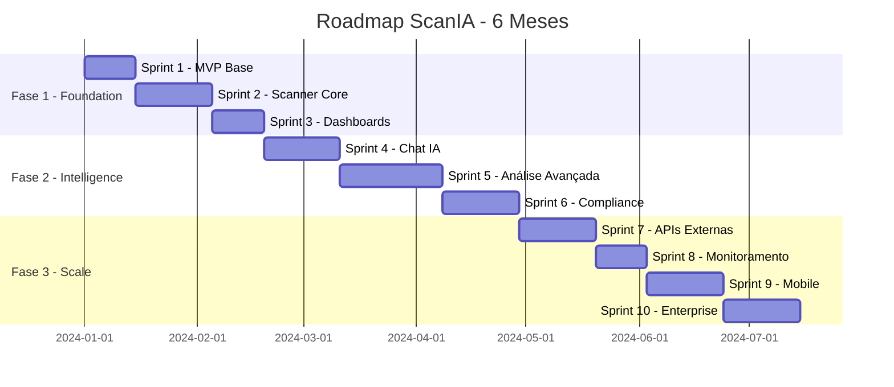

# Roadmap do ScanIA

## 🎯 Visão Estratégica

O ScanIA será desenvolvido em **3 fases principais** ao longo de **6 meses**, evoluindo de um MVP funcional para uma plataforma completa de cybersegurança.

## 📅 Timeline Geral

## 🏗️ Fases de Desenvolvimento

### 🚀 Fase 1: Foundation (Meses 1-2)
**Objetivo**: Criar base sólida e MVP funcional

#### Sprint 1: MVP Base (2 semanas)
- ✅ Estrutura do projeto
- ✅ Autenticação e autorização
- ✅ Interface básica (dark mode)
- ✅ Deploy inicial

#### Sprint 2: Scanner Core (3 semanas)
- 🔍 Scanner de vulnerabilidades básico
- 📄 Geração de relatórios PDF
- 🗄️ Armazenamento de resultados
- 🔗 Integração OWASP ZAP

#### Sprint 3: Dashboards (2 semanas)
- 📊 Dashboard principal
- 📈 Visualizações de dados
- 📱 Interface responsiva
- 🎨 UX/UI refinado

### 🧠 Fase 2: Intelligence (Meses 3-4)
**Objetivo**: Adicionar inteligência artificial e análises avançadas

#### Sprint 4: Chat IA (3 semanas)
- 💬 Interface de chat inteligente
- 🤖 Bot de cybersegurança
- 📝 Análise de linguagem natural
- 🔍 Consultas interativas

#### Sprint 5: Análise Avançada (4 semanas)
- 🎯 Scanners especializados
- 🧮 Machine Learning para detecção
- 🌐 Threat Intelligence
- 📋 Análise de compliance

#### Sprint 6: Compliance (3 semanas)
- 📜 Frameworks de segurança
- ✔️ Checklist automatizado
- 📊 Relatórios de compliance
- 🏛️ Normas brasileiras (LGPD)

### 🌐 Fase 3: Scale (Meses 5-6)
**Objetivo**: Expansão e funcionalidades enterprise

#### Sprint 7: APIs Externas (3 semanas)
- 🔌 Integrações com ferramentas
- 📡 APIs públicas
- 🔄 Webhooks e automações
- 🛠️ Marketplace de plugins

#### Sprint 8: Monitoramento (2 semanas)
- 📊 Monitoramento contínuo
- 🚨 Alertas inteligentes
- 📈 Métricas avançadas
- 🔍 Observabilidade completa

#### Sprint 9: Mobile (3 semanas)
- 📱 App mobile nativo
- 📲 Notificações push
- 🔔 Alertas em tempo real
- 📊 Dashboard mobile

#### Sprint 10: Enterprise (3 semanas)
- 🏢 Multi-tenant
- 👥 Gestão de equipes
- 🔐 SSO empresarial
- 📊 Analytics avançados

## 📊 Marcos e Entregas

### 🎯 Marco 1: MVP (Fim do Sprint 3)
**Data**: Final do Mês 2
**Entregáveis**:
- ✅ Sistema funcional completo
- ✅ Scanner básico operacional
- ✅ Relatórios PDF gerados
- ✅ Dashboard com métricas
- ✅ Deploy em produção

**Critérios de Aceitação**:
- [ ] Usuário pode se cadastrar e fazer login
- [ ] Usuário pode executar scan de URL
- [ ] Sistema gera relatório PDF
- [ ] Dashboard mostra estatísticas básicas
- [ ] Sistema suporta 10 usuários simultâneos

### 🧠 Marco 2: IA Funcional (Fim do Sprint 6)
**Data**: Final do Mês 4
**Entregáveis**:
- 🤖 Chat IA completamente funcional
- 🔍 Análises avançadas de segurança
- 📋 Compliance automatizado
- 🌐 Threat intelligence integrado

**Critérios de Aceitação**:
- [ ] Chat responde perguntas de cybersegurança
- [ ] Análise automatizada de vulnerabilidades
- [ ] Relatórios de compliance LGPD
- [ ] Detecção de ameaças em tempo real
- [ ] Sistema suporta 100 usuários simultâneos

### 🌐 Marco 3: Plataforma Completa (Fim do Sprint 10)
**Data**: Final do Mês 6
**Entregáveis**:
- 🏢 Solução enterprise completa
- 📱 Aplicativo mobile
- 🔌 Ecosystem de integrações
- 📊 Analytics avançados

**Critérios de Aceitação**:
- [ ] Multi-tenant funcional
- [ ] App mobile na store
- [ ] 10+ integrações disponíveis
- [ ] Monitoramento 24/7 ativo
- [ ] Sistema suporta 1000+ usuários

## 📈 Métricas de Sucesso

### Técnicas
- **Performance**: Response time < 200ms
- **Scalability**: 1000+ concurrent users
- **Reliability**: 99.9% uptime
- **Security**: Zero critical vulnerabilities

### Produto
- **User Adoption**: 100+ active users/month
- **Feature Usage**: 80% feature adoption rate
- **User Satisfaction**: NPS > 8.0
- **Retention**: 70% monthly retention

### Negócio
- **Cost Efficiency**: < $100/month infrastructure
- **Revenue Potential**: Modelo freemium viável
- **Market Fit**: Feedback positivo de beta users
- **Scalability**: Arquitetura suporta 10k+ users

## 🚨 Riscos e Mitigações

### Alto Risco
1. **Complexidade da IA**
   - *Risco*: Chat IA não atender expectativas
   - *Mitigação*: Usar modelos pré-treinados + fine-tuning
   - *Plano B*: Interface baseada em regras

2. **Performance dos Scanners**
   - *Risco*: Scans lentos ou instáveis
   - *Mitigação*: Implementar queue system + workers
   - *Plano B*: Scanners síncronos com timeout

3. **Custos de Infraestrutura**
   - *Risco*: Custos além do orçamento
   - *Mitigação*: Monitoramento contínuo + alertas
   - *Plano B*: Otimização e scaling down

### Médio Risco
1. **Integração de Ferramentas**
   - *Risco*: APIs externas instáveis
   - *Mitigação*: Circuit breakers + fallbacks
   - *Plano B*: Implementação própria

2. **Compliance Legal**
   - *Risco*: Regulamentações não atendidas
   - *Mitigação*: Consultoria jurídica + auditoria
   - *Plano B*: Features básicas apenas

## 🔄 Processo de Desenvolvimento

### Metodologia
- **Framework**: Scrum adaptado
- **Sprints**: 2-4 semanas cada
- **Reviews**: Semanais
- **Retrospectives**: Final de cada sprint

### Qualidade
- **Code Reviews**: Obrigatórios
- **Testes**: 80%+ coverage
- **CI/CD**: Deploy automatizado
- **Monitoring**: Métricas em tempo real

### Comunicação
- **Daily Standups**: Progresso diário
- **Sprint Planning**: Início de cada sprint
- **Demo Days**: Apresentação de resultados
- **Documentation**: Atualização contínua

## 📚 Dependências Externas

### Tecnológicas
- **APIs de CVE**: NIST, MITRE
- **Threat Intelligence**: OTX, VirusTotal
- **Cloud Services**: AWS/GCP/Azure
- **CDN**: CloudFlare

### Regulatórias
- **LGPD**: Compliance brasileiro
- **GDPR**: Usuários europeus
- **SOC2**: Certificação futura
- **ISO 27001**: Padrões internacionais

### Parcerias
- **Security Vendors**: Integração APIs
- **Cloud Providers**: Créditos iniciais
- **Open Source**: Contribuições
- **Academia**: Pesquisa e validação

---

Este roadmap é dinâmico e será ajustado conforme feedback e necessidades do mercado. Cada sprint tem entregas concretas e valor agregado ao usuário final.